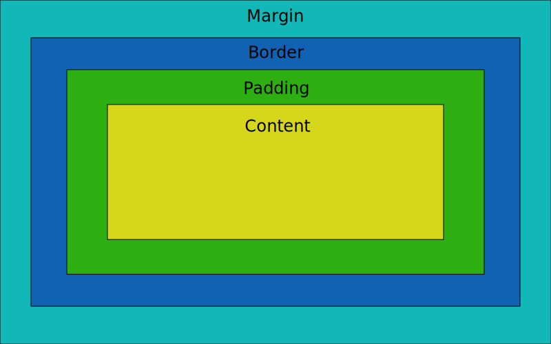

# MSGUI Layout Engine (MLE)

### Layout Box Policy

Box policy is (from outter to inner):
  1. MARGIN 2. BORDER 3. PADDING 4. CONTENT



### Layout Scale Types

Supported scale types:

- **PX** Absolute value in pixels, doesn't change dynamically.
- **REL(ATIVE)** Scale value from zero to one relative to the parent's scale and it does change dynamically
- **FIT** Scale will be computed as the minimum required scale in order to fit all children snugly inside. Doesn't change dynamically.
- **FILL** => Fully fill the parent's scale. **FIT/REL/PX** nodes on same level have priority and **FILL** gets the use the remaining space.

### Scale Algorithm
Algorithm will run in order to calculate the scale of the direct sub-nodes of the node.
In case a sub-node is of scale type **FIT** the calculation may go deeper.
The root node always has the scale callculated as the scale of the window it's attached to.

***Preconditions***: Node is not one that calculates scale in a special way (See Note 1)\
***Input***: Calculated node with uncalculated sub-nodes\
***Output***: Scale calculated for the node's subnodes

- ***.trScale** is the actual scale that will be used to compute the transform matrix. Doesn't include margins/padding.
- ***.scale** is the user-set value that aids the algorithm decide the final transform. Includes margins.
  
```py
def computeScale(node):
    nodeFreeSpace = subNode.trScale
    fitNodesCnt = 0
    for subNode in node:
        if subNode.scaleType is PX:
            subNode.trScale = subNode.scale
        elif subNode.scaleType is REL:
            subNode.trScale = subNode.scale * node.trScale
        elif subNode.scaleType is FIT:
            subNode.trScale = computeFitScale(subNode)
        else
            fitNodesCnt++
        nodeFreeSpace -= subNode.trScale

    if fitNodesCnt is 0:
        return

    equalFreeSpace = node.subNodeCnt / fitNodesCnt
    for subNode in node:
        if subNode.scaleType is FILL:
            subNode.trScale = equalFreeSpace

def computeFitScale(node) -> scaleValue:
    totalScale = 0
    for subNode in node:
        if subNode.scaleType is PX:
            totalScale += subNode.scale
        elif subNode.scaleType is FIT:
            totalScale += computeFitScale(subNode)
        elif subNode.scaleType is (REL or FILL): # These require size to be known already
            throw not supported
    
    return totalScale
```


> **Note 1:** List of special nodes that compute scale in non-standard way:
> - Example one
> - Example two

### Layout Positioning

Positioning has to be done after the scale pass for each node.

Positioning has to take into account:
- **overflow** Allow overflow flag
- **wrap** Allow wrap flag
- **type** Type of the layout (**HORIZONTAL/VERTICAL/GRID**)
- **margin**
- **border**
- **padding**
- **selfAlign** Per sub node self alignment aka where to align each sub node in relation to the other subnodes (**TOP/BOTTOM/LEFT/RIGHT/CENTER** + the 8 combinations in case of a **GRID** layout)
- **alignSubnodes** Sub nodes alignment aka where to align sub nodes in relationship to node's empty space (**TOP/BOTTOM/LEFT/RIGHT/CENTER** + the 8 combinations in case of a **GRID** layout)
- **spacing** Sub node spacing (**TIGHT/EVEN_WITH_NO_START_GAP/EVEN_WITH_START_GAP**) TODO: Needed anymore?
- **TBA** Grid stuff TBA

### Positioning Algorithm
Algorithm will run in order to calculate the position of the direct sub-nodes of the node.\
Bellow algorithm is for **HORIZONTAL** and **VERTICAL** type layouts. As they are analogous and only differ by what axis is being used, code shown is for the horizontal axis.\
The main idea is to calculate the sub nodes positioning having a (0, 0) reference frame and then pushing everything to be in reference to the node instead.

***Preconditions***: Node is not one that positions elements in a special way\
***Input***: Calculated node with uncalculated sub-nodes\
***Output***: Scale & Position calculated for the node's children

- ***.trPos** is the actual position that will be used to compute the transform matrix. Includes everything but margins

```py
def computePosition(node):
    startPos = node.padding # Padding is our (0, 0) reference frame
    maxElementSize = 0
    for subNode in node:
        startPos += subNode.margin.left
        subNode.trPos.x = startPos
        startPos.x += subNode.trPos.x + subNode.margin.right

        maxElementSize = max(maxElementSize, occupiedSize(subNode).y)

    # Align each subnode relative to the other subnodes on the same line/column
    for subNode in node:
        subNode.trPos.y += computeSubNodesAlignOffsetXY(subNode.selfAlign, maxElementSize)

    # Align subnodes relative to node's left space
    overflow = computeSubNodesOverflow(node)
    xyToAlign = computeSubNodesAlignOffsetXY(node.alignSubnodes, overflow)
    for subNode in node:
        subNode.trPos += xyToAlign

    # Change to node's reference frame
    for subNode in node:
        subNode.trPos.x += node.trPos.x 

def computeSubNodesAlignOffsetXY(selfAlign, maxElementSize) -> offset:
    offsetValue = 0

    if alignSubnodes.x is CENTER:
        offsetValue.x = -overflow.x * 0.5
    elif alignSubnodes.x is BOTTOM:
        offsetValue.x = -overflow.x

    if alignSubnodes.y is CENTER:
        offsetValue.y = -overflow.y * 0.5
    elif alignSubnodes.y is RIGHT:
        offsetValue.y= -overflow.y
    
    return offsetValue

def computeSubNodesAlignOffsetXY(alignSubnodes, overflow) -> offset:
    offsetValue = {0, 0}

    if alignSubnodes.x is CENTER:
        offsetValue.x = -overflow.x * 0.5
    elif alignSubnodes.x is BOTTOM:
        offsetValue.x = -overflow.x

    if alignSubnodes.y is CENTER:
        offsetValue.y = -overflow.y * 0.5
    elif alignSubnodes.y is RIGHT:
        offsetValue.y= -overflow.y
    
    return offsetValue
```